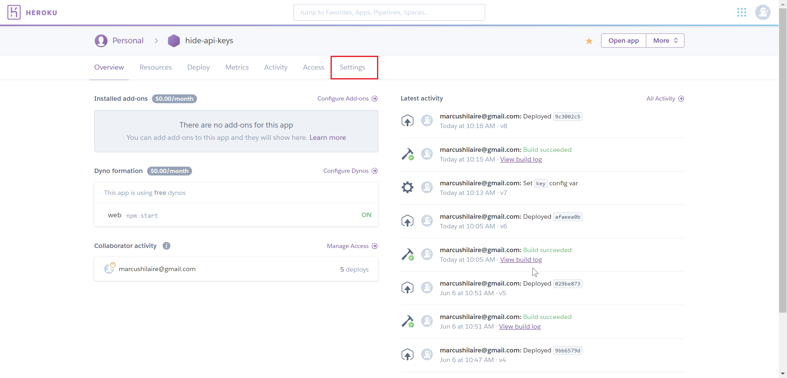
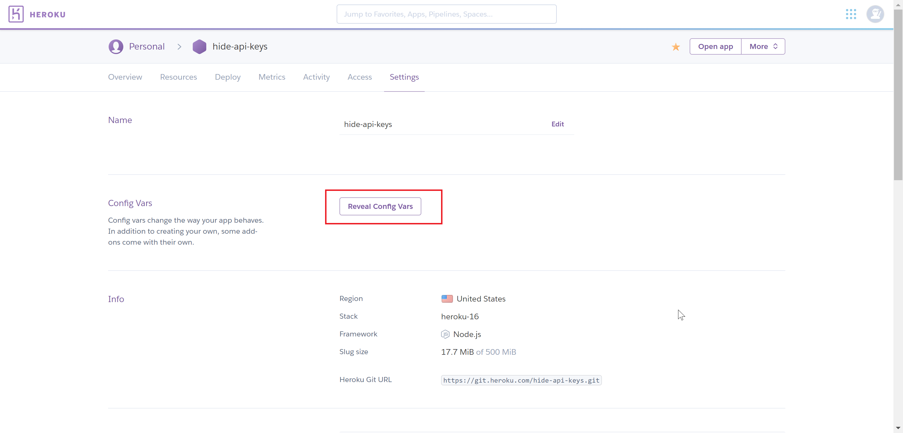
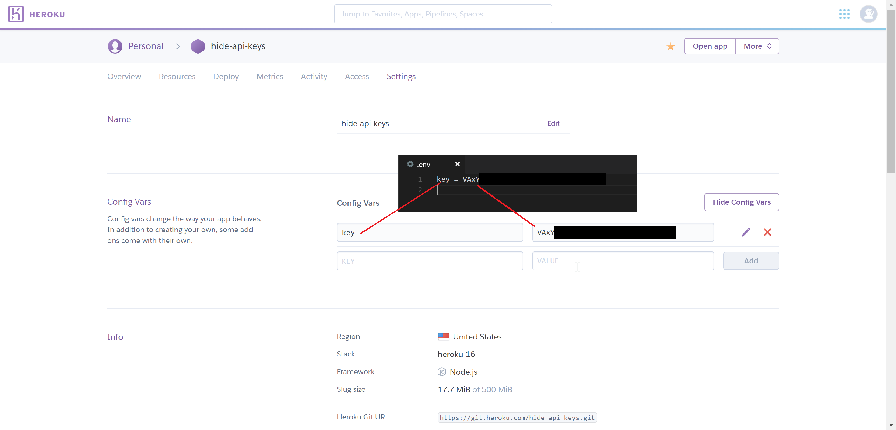

# Hiding API Keys in deployment

For this tutorial I built upon a [small front end application](https://github.com/marcushilaire/giphy) by giving it a basic back end structure so it could be used as an appropriate example.

Written with:

- [Express](https://www.npmjs.com/package/express)
- [dotenv](https://www.npmjs.com/package/dotenv)

## Configuration Variables on Heroku

#### Access the settings page from Heroku.



#### Reveal configuration variables.



#### Setting the configuration variables


Define the configuration variable key value pairs as shown above.

Any code referencing the `process.env`object, [keys.js](keys.js) for example, will pull from config variables when deployed or the `.env` file in development.

## Sending variables from the server to the client

### [Server Side](server.js)

Set up a route on the server where the client can request a variable:

```js
app.post("/apiKey", function(req, res) {
  console.log("api key requested");
  res.status(200).send(apiKey);
});
```

### [Client Side](./public/logic/logic.js)

Set up a get request from the client to retrieve a variable:

```js
var fetchKey = function() {
  return $.ajax({ url: "/apiKey", method: "POST" });
};

var useKey = function() {
  fetchKey().then(function(apiKey) {
    console.log(apiKey);
    // Do things...
  });
};
```
